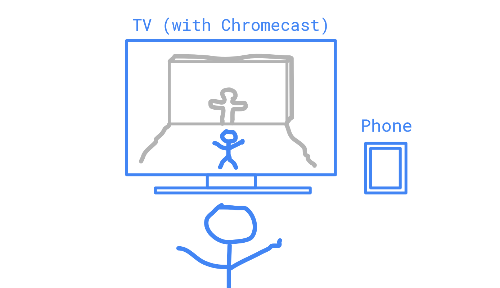

# Hole in the Wall

A fun Android game to play at home in front of your TV.

## About this app

Hole in the Wall is a fun AR game which works in a similar way as various “Hole in the Wall” TV shows (For example see https://youtu.be/sHpKiX87X2c).   

In the game the player is approached by a moving solid wall. The wall has a cut-out and the goal is to perform a physical body posture in order to slip through the cut-out of the wall.

The app will use the Google Cast SDK to show a wall on a Chromecast enabled TV. In addition the app will use a TensorFlow lite PoseNet model to detect the current posture of the user.

The following scribble shows how the set-up looks like  

## Cover Letter

The cover letter can be found here: https://docs.google.com/document/d/1Dp36lDI9tpCZjjxI3JvbPpNC2fIU2MppGMoLcWywbTM/edit?usp=sharing

## Acknowledgements

Parts of the code are based on the [official TensorFlow Lite PoseNet example](https://github.com/tensorflow/examples/tree/master/lite/examples/posenet/android)
